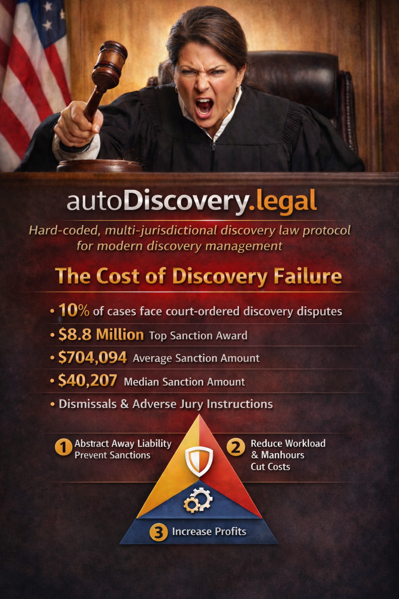

<div align="center">


# AutoDiscovery



### *GeoOracle Auto Compliance: build once, comply everywhere.*

**A Midnight-based dApp that automates legal discovery with jurisdiction-aware compliance,<br>zero-knowledge proofs, and privacy-first architecture.**

[](https://midnight.network)
[](./LICENSE)
[]()
[]()
[]()

---

**[Project Overview](./docs/PROJECT_OVERVIEW.md)** · **[Build Plan](./docs/BUILD_PLAN.md)** · **[Architecture](./docs/SMART_CONTRACT_PARTITIONING.md)** · **[Discovery Protocol](./docs/discovery-automation/README.md)** · **[Email Safety](./docs/EMAIL_SAFETY_PROTOCOL.md)**

</div>

---

## The Problem

With legal discovery sanctions reaching **$8.5 million in a single case** and **6 attorneys referred to the State Bar** for discipline, discovery management in its current state is a huge problem in the US.

The legal discovery process is messy, time consuming, and varies by jurisdiction — with enormous consequences for compliance failures resulting in lost cases, unfavorable case delays, extremely expensive sanctions, and **the potential of being disbarred.**

<table>
<tr>
<td align="center"><strong>$8.5M+</strong><br><sub>Top sanction award<br>(single case)</sub></td>
<td align="center"><strong>$704,094</strong><br><sub>Average sanction<br>amount</sub></td>
<td align="center"><strong>38,000+</strong><br><sub>NYC cases dismissed in 2024<br>from discovery failures</sub></td>
<td align="center"><strong>28%</strong><br><sub>of all legal malpractice claims<br>stem from missed deadlines</sub></td>
<td align="center"><strong>$30B+</strong><br><sub>annual US litigation cost<br>consumed by discovery</sub></td>
</tr>
</table>

> In New York City alone, 38,000+ cases were dismissed in 2024 due to discovery compliance failures — and conviction rates dropped from 50% to 25%. Nationally, discovery consumes **20–50% of total litigation costs** — over **$30 billion a year**.

---

## The Solution

With **autoDiscovery.legal**, we aim to organize and formalize a **hard-coded, geographically compliant, law-based protocol** that will help organize, distribute, and give proper, accurate, and secure access control to user-aggregated legal discovery.

This protocol will **abstract away liability**, reduce man hours and overall costs, increase profits, and form an **immutable (existing forever) proof of compliance, custody, provenance, and access.**

It is our hope that autoDiscovery.legal will be the **default protocol for accurate and dependable discovery/evidence management** — backed with error insurance that will protect law firms from errors and omissions.

> *"AutoDiscovery doesn't just help you manage discovery — it mathematically proves you did it right."*

---

## What AutoDiscovery Does

<table>
<tr>
<td width="50%">

### Privacy-First Discovery Automation
- **GeoOracle Compliance** — Detects case jurisdiction and auto-applies the correct procedural rules (IRCP, URCP, CR, FRCP, and more)
- **9-Step Discovery Protocol** — 24 universal document categories, party attribution, origination tracking, chain-of-custody, and AI-assisted metadata extraction
- **Zero-Knowledge Proofs** — Compliance attestations become immutable court records without exposing underlying data
- **Selective Disclosure** — Reveal only what's required, nothing more

</td>
<td width="50%">

### Intelligent Safeguards
- **Email Safety Protocol** — Threat-level classification when composing emails to opposing counsel, judges, or external parties ([details](./docs/EMAIL_SAFETY_PROTOCOL.md))
- **Tandem Approval** — N sets of eyes must sign off before sensitive emails can send
- **Attachment Scanning** — Metadata warnings for EXIF data, tracked changes, hidden PDF layers
- **Case Contact Management** — Team-based contact organization with role-aware visual cues, precedence ratings, and connected-contact highlighting

</td>
</tr>
</table>

---

## Architecture

```
┌──────────────────────────────────────────────────────────────────────┐
│                        USER'S MACHINE                                │
│  Local state: documents, AI metadata, search indexes, encryption     │
├──────────────────────────────────────────────────────────────────────┤
│                     PRIVATE LEDGER (on-chain, encrypted)             │
│  Document metadata · Party records · Deadlines · Case details        │
├──────────────────────────────────────────────────────────────────────┤
│                   PUBLIC LEDGER (on-chain, immutable)                 │
│  Compliance proof hashes · Timestamps · Production Merkle roots      │
├──────────────────────────────────────────────────────────────────────┤
│                    SEALED LEDGER (write-once)                        │
│  Commitment schemes · Pre-disclosure freezes                         │
└──────────────────────────────────────────────────────────────────────┘
```

### Smart Contract Suite (6 Contracts)

| Contract | Purpose |
|----------|---------|
| **discovery-core** | Case lifecycle, discovery steps, obligation tracking |
| **jurisdiction-registry** | GeoOracle rule packs per jurisdiction |
| **compliance-proof** | ZK attestation generation and verification |
| **document-registry** | Production tracking, Merkle trees, Twin Protocol bonds |
| **access-control** | YubiKey-based authentication, role-gated permissions |
| **expert-witness** | W-9/I-9 workflows, qualification attestation |

> 📐 **[Full Architecture →](./docs/SMART_CONTRACT_PARTITIONING.md)** · **[YubiKey Access Control →](./docs/YUBIKEY_ACCESS_CONTROL.md)** · **[Discovery Automation →](./docs/discovery-automation/README.md)**

---

## Tech Stack

| Layer | Technology | Purpose |
|-------|------------|---------|
| **Frontend** | React 19 · Vite 6 · TypeScript 5 · Tailwind CSS 4 | Glass-morphism UI with jurisdiction comparatives |
| **UI Components** | shadcn/ui · Lucide Icons | Accessible, themeable component library |
| **Smart Contracts** | Compact (Midnight) | Privacy-preserving ZK smart contracts |
| **Blockchain** | Midnight Network | Dual-ledger (public + private) with ZK proofs |
| **Wallet** | Lace Browser Extension | User key management and transaction signing |
| **Build** | Turborepo · npm workspaces | Monorepo orchestration |
| **Hosting** | Vercel / Netlify | Frontend deployment |

---

## Project Structure

```
AutoDiscovery/
├── frontend-vite-react/           # React application
│   ├── src/
│   │   ├── components/            # Reusable UI (email safety dialog, etc.)
│   │   ├── layouts/               # App shell, sidebar, navigation
│   │   ├── pages/                 # Dashboard, case view, contacts, login
│   │   ├── providers/             # Provider pattern (auth, cases, docs, AI, contacts, email safety)
│   │   │   └── demoland/          # Mock providers for demo environment
│   │   └── lib/                   # Utilities
│   └── public/
├── autodiscovery-contract/        # Compact smart contracts & TypeScript types
│   └── src/types/                 # Strongly-typed data model (6 entities)
├── autodiscovery-cli/             # CLI tools for deployment & operations
├── docs/                          # Comprehensive documentation (20+ docs)
│   ├── discovery-automation/      # 9-step discovery protocol deep dives
│   └── reference/                 # Jurisdiction research archives
├── media/                         # Brand assets
└── turbo.json                     # Monorepo configuration
```

---

## Quick Start

### Prerequisites

| Tool | Version | Link |
|------|---------|------|
| Node.js | v23+ | [nodejs.org](https://nodejs.org/) |
| npm | v11+ | Bundled with Node.js |
| Docker | Latest | [docker.com](https://docs.docker.com/get-docker/) |
| Git LFS | Latest | [git-lfs.com](https://git-lfs.com/) |
| Compact Compiler | Latest | [docs.midnight.network](https://docs.midnight.network/relnotes/compact-tools) |
| Lace Wallet | Latest | [Chrome Web Store](https://chromewebstore.google.com/detail/hgeekaiplokcnmakghbdfbgnlfheichg) |

### Setup

```bash
# Clone the repository
git clone git@github.com:bytewizard42i/AutoDiscovery.git
cd AutoDiscovery

# Install all dependencies (monorepo)
npm install

# Build smart contracts
npm run build

# Start frontend in demoLand mode
npm run dev:frontend
```

### Environment Variables

```bash
# Copy environment templates
cp autodiscovery-cli/.env_template autodiscovery-cli/.env
cp frontend-vite-react/.env_template frontend-vite-react/.env
```

---

## Documentation Index

| Document | Description |
|----------|-------------|
| **[Project Overview](./docs/PROJECT_OVERVIEW.md)** | Executive summary, problem statement, solution architecture |
| **[Build Plan](./docs/BUILD_PLAN.md)** | Living roadmap with phase tracking |
| **[Smart Contract Partitioning](./docs/SMART_CONTRACT_PARTITIONING.md)** | 6-contract architecture, private/public/sealed state mapping |
| **[Discovery Automation](./docs/discovery-automation/README.md)** | 9-step protocol, 24 categories, Merkle hashing, Twin Protocol |
| **[Email Safety Protocol](./docs/EMAIL_SAFETY_PROTOCOL.md)** | Threat levels, recipient flags, attachment scanning, tandem approval |
| **[Case Contacts Feature](./docs/CASE_CONTACTS_FEATURE.md)** | Team-based contacts, star precedence, connected glow, drag reorder |
| **[YubiKey Access Control](./docs/YUBIKEY_ACCESS_CONTROL.md)** | Hardware key auth design (3 modes) |
| **[DemoLand vs RealDeal](./docs/DEMOLAND_VS_REALDEAL.md)** | Mock vs production architecture split |
| **[Jurisdiction Deep Dive](./docs/JURISDICTION_DEEP_DIVE.md)** | ID, OH, WA, UT, CA, NY rule mapping |
| **[Customer Analysis Matrix](./docs/CUSTOMER_ANALYSIS_MATRIX.md)** | Market research and adoption strategy |
| **[UI Design Notes](./docs/UI_DESIGN_NOTES.md)** | Brand palette, glass morphism, component guidelines |

---

## Jurisdiction Coverage

<table>
<tr>
<td align="center" width="16%"><strong>Idaho</strong><br><sub>IRCP</sub><br>Primary</td>
<td align="center" width="16%"><strong>Ohio</strong><br><sub>ORCP</sub><br>Phase 2</td>
<td align="center" width="16%"><strong>Washington</strong><br><sub>CR</sub><br>Phase 3</td>
<td align="center" width="16%"><strong>Utah</strong><br><sub>URCP</sub><br>Phase 4</td>
<td align="center" width="16%"><strong>California</strong><br><sub>CCP</sub><br>Phase 5</td>
<td align="center" width="16%"><strong>New York</strong><br><sub>CPLR</sub><br>Phase 6</td>
</tr>
</table>

> Modular jurisdiction rule packs — add new states/federal circuits without code changes.

---

## Email Safety Protocol

One of AutoDiscovery's standout features — a multi-layered protection system that prevents accidental disclosure to the wrong party.

| Threat Level | Trigger | Action |
|:---:|---|---|
| **SAFE** | All recipients on our team | Standard send |
| **CAUTION** | Court staff, unknown recipients | Review content |
| **DANGER** | Opposing counsel or their team | Attachment review + tandem recommended |
| **CRITICAL** | Judge or magistrate | Tandem approval **REQUIRED** (2 approvers) |

Features include **recipient auto-detection** against the case contacts database, **attachment metadata scanning** (EXIF, tracked changes, hidden PDF layers), **image preview before send**, and a **tandem approval workflow** where N approvers must sign off on sensitive communications.

> 📧 **[Full Protocol Documentation →](./docs/EMAIL_SAFETY_PROTOCOL.md)**

---

## Team

<table>
<tr>
<td align="center" width="50%">

### Spy
**[@SpyCrypto](https://github.com/SpyCrypto)**

Domain Expert · Legal Discovery Specialist

20 years complex litigation paralegal experience. Published statistics reports for Idaho government agencies. Jurisdiction expertise across Idaho, Utah, and Washington.

**[Full Dossier →](./docs/TEAM_SPY.md)**

</td>
<td align="center" width="50%">

### John
**[@bytewizard42i](https://github.com/bytewizard42i)**

Developer · Midnight Builder · Architect

Full-stack development, smart contract architecture, ZK protocol design, and the vision behind privacy-first legal technology.

</td>
</tr>
</table>

---

<div align="center">

### Midnight Vegas Hackathon — April 2026

*Privacy meets compliance. Built on [Midnight Network](https://midnight.network).*

**Where every document has a chain of custody, every deadline is tracked,<br>and no one accidentally emails the judge.**

---

<sub>Copyright 2026 AutoDiscovery Team. All rights reserved.</sub>

</div>
